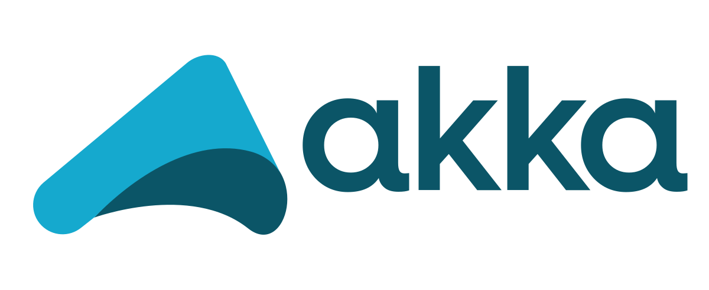

# バッチ基盤としてのK8S

#### 株式会社セプテーニ・オリジナル
##### 高嶋 隆博

---

## 自己紹介
- 高嶋 隆博 (@takashima0411)
- SO社2016年8月入社
	- ScalaでWebアプリケーション開発
	- GCP、GKEのでインフラ構築
	- バッチ基盤の構築
- k8sはこの三月からプロジェクトで利用開始

---

## 会社紹介

#### 主な業務
- 広告の効率的な運用
- ブランディング
- 静止画、動画といったコンテンツの制作

Note:

- 各社広告主様の代わりに広告の運用を行や静止画、動画といったクリエイティブの作成を行っている

---

#### SO社でやっている一例
- 運用のためのデータ収集
- 分析基盤提供
- クリエイティブ制作の効率化

Note:

- SO社はその運用のためのデータ収集や分析基盤提供、クリエイティブ制作の効率化といった面で技術的サポートしている

---

#### チーム役割
- メディアが提供しているAPIからレポートを収集
- BigQueryを利用して事前集計

*この事前集計の部分が今回の話の中心*

Note:

- 我々はFacebookやGoogleといったメディアが提供しているAPIからレポートを収集し、BQを利用して事前集計し日中の分析業務がスムーズに行えるように事前に集計している

---

### バッチ処理をしている内容

---

#### レポートの収集
- 大手メディア(Facebook,Google..etc)は、広告の見られた回数やクリックされた回数といった成績(レポート)を提供してる。  
- レポートの形式はJSONかCSV多い
- 一日一回それらのAPIを活用しレポートを収集、少し加工してGCSに保管している。

Note:

- FacebookやGoogleといった大手メディアは、広告の見られた回数やクリックされた回数といった成績(レポート)をAPIから取得できるようにしてくれています。
- レポートはJSONだったり、CSVだったりする。まずは一日一回それらのAPIにアクセス、少し加工してGCSに保管している。

--- 
 
#### BQでの事前集計
- レポートデータ量は膨大
- 事前にある程度集計しておかないと日中の分析業務がスムーズに行えない
- BQにデータをロードし集計させ、分析しやすい状態にしたのちRDBに投入

Note:

- データ量は膨大なので、事前にある程度集計しておかないと日中の分析業務がスムーズに行えなくなります。
- なので、予めBQにデータをロードし集計させ、分析しやすい状態にしたのちRDBに書き込んでいます。

---

## 弊社のバッチジョブの歴史

Note:

- 弊社ではいろいろバッチジョブとその実行方法を試してきたので、それらから得られた課題を紹介しようかと思います。

---

### Webアプリと同梱しCRON + CURLで起動

WebアプリケーションのAPIの一つとしてバッチを提供していた。
起動はcron用のサーバからcurlでAPIを叩いて実行していた。

Note:

- バッチ処理をWebアプリケーションと同じソースコードを流用できるのが強み。

---

#### この方法の問題点
- バッチ実行時のアプリケーションへの負荷
- バッチ時にも大丈夫なようにな性能にしておいた場合、アクセスがない間はリソースが余ってしまう
- 失敗したバッチは常に最初からやりなおし

Note:

- Webアプリケーションとバッチの実行環境が同じサーバであるため、バッチ処理が始まってしまうとアプリケーションの動作に影響があります
- 一応分析業務は日中にしかないので、深夜遅くなったとしても要件的には大きな問題があったわけではなかった
- しかし、日中の負荷に比べてバッチ中の負荷がとても大きくバッチ時にリソースを合わせると日中にリソースが無駄になってしまう
- 作りの問題ではあるが、バッチのやり直しは用意であるものの、途中から再開というのは難しい

---

### Akkaによるバッチ

- アクターモデルによりバッチを実装
    - 失敗時にスーパーバイザによって適切にハンドリングされるのが良い点
    - 通知とか、リトライとか
- バッチの処理内容は全てScalaで書かれている
- 一方であまりにコードの管理が難しい状態になってしまい、なかなか面倒くさいことに
    - バッチの全体像を把握しづらい
         - アクターの親子関係図を見ながらでないといじれない
    - 部分的な再実行が難しい
         - これは作りの問題だが、バッチは途中から再開したいことも多い
    - やはりリソースが無駄になっていた

Note:

- 問題があった場合に復帰しやすいようにしたいというモチベーション
    - メディアの中にはAPIが不安定なものがあり、何度か実行するとうまくいくとがあったりする。
    - 不安定なAPIに対し、スーパーバイザを利用することでリトライや通知といった戦略を練りやすい
- しかし、個々のタスクが一つのアクターとなったのが設計ミスだったとの反省がある
- アクター同士のつながりが分かりづらく全体像が想像し辛い

---

### Digdagによるバッチ

- TD社が作成しているワークフローエンジン。トレジャーデータとの統合が用意であることとJavaで書かれいてることが特徴。
- ジョブの記述がyamlなのでエディタで編集しやすい
- 様々なオペレータ(Jobの実行部分)が用意されていて初めてでもわかりやすい
- ジョブの実行準備や部分的な並列実行が容易
- 成功/失敗の通知やリトライなどもやってくれる
    - 標準ではemailやhttpがあるが、弊社では通知は主にSlackを活用
- ログの履歴が一箇所にWebコンソールにまとまっている
- Javaで機能の追加/変更が出来る

Note:

- 弊社はScalaが中心の会社なので、Javaで拡張をかけるのはありがたい
- 例えばBQオペレータではBQに集計をさせることができ、S3オペレータではファイルをS3に転送することができる
- ShellオペレータやRubyオペレータで自分でそのつど自分で定義することもできる
- 今までログの収集や、ジョブの実行結果/履歴というのはサーバに入ってみていたのがその必要がなくなった
- また、yamlは小さいタスクで細かく分けやすい
- 今まで途中まで失敗したときに、そこから再開とかはできなかったがDigdagならタスクを小さくしたおかげもありボタンひとつで

---

## Digdagでの失敗
- オペレータで重い処理を実行した
- 一応ジョブを実行するサーバを分けることができるのだが、負荷分散があまり上手ではない
- すでにCPUリソースがカツカツのサーバが新しいサーバジョブを実行しようとしてしまう
    - その脇で暇そうなサーバが！？
        - Digdagではできる限り、スケジューリングなど以外のことをさせないほうがいいかも

Note:

- Digdagの問題ではなく使い方のミス
- オペレータは何も考えずに実行すると、Digdagのワーカーがいるサーバで実行される
- javaとかembulkを呼び出してメモリを食うことがありワーカー全体が非常に重い状態に
- また、スケジューリングがあまり理解出来ておらずすでにいっぱいいっぱいのサーバにまたタスクを振り当てられる等がつづいた
- 今まで問題だった課題はDigdagがだいたい解決してくれたのであとはリソースが問題
- そんなときにkubernetesのJob機能をしった
- そうだ！k8sにはJOB機能があったな。うまく一緒に活用できないだろうか？

---

## k8s job
- 指定したコンテナにコマンドを与えて何らかの処理を実行できる。
    - 更に失敗した場合にリトライさせたり、cronで定期実行でき簡単なバッチなら組めそう
- ただし、Aを実行したあとにBを実行して…などとするのは難しい。それはDigdagがやってくれる。
- 弊社ではk8sのjob用のオペレータを用意し活用している

Note:
- はじめはシンプルにShellでやっていた
- しかしShellでやるとDigdagで設定した変数がどこにどう反映されるのかが分かりづらく、ワークフローを書くのが非常に難しくなった
- なのでDigdagようにオペレータを作成した
- これは先程のような面倒ごとがないため非常にやりやすくなった
- しかし、kubernetes-client/javaはあまりにあまりにもなので、かなり辛かった
- 特定の操作を呼ぶと成否を問わずExceptionが発生するとか

---

## Digdag meet's Kubernetes
- リソース問題はkubernetesが解決！
    - Node
    - 日中のバッチがない時間と、バッチ中のリソースの要求量の差を吸収してくれる
    - 必要なライブラリ等はすべてDockerImageで用意すればいい
- ローカルでの動作確認等も楽
- Secretの情報をk8sに寄せられるため(Digdagのそれに比べ)秘密情報が楽に管理、配布できる
- 通常実行時のログはDigdagが収集してくれるが、現在の構成だとGKEがStackdriverLoggingにすべて集めてくれる
    - ただし、あまりにノードに負荷をかけるとfluentdのクライアントが止まってしまい

Note:
- JOBはCPUやメモリを設定しておけばいい感じに開いてるノードに振り分けてもらえる
- 更に必要であればノードの追加までやってくれる
- Digdagだけだったときに比べて動作確認がやりやすくなった。ローカルでの環境構築は不要でDockerに任せられるし。
- ローカルでやる場合はローカルでDigdagサーバを立てて実行している。
- そうすると計算リソースはk8sに頼れるのでマシンが重くならない

---

### k8sのJOB機能だけではだめなの？
- CRONもあるし、比較的シンプルなタスクを実行する分には問題ない
- しかし複数あるステップあるようなものには向いていない印象
    - Aが終わったらBを実行、Bが終わったらCとDとEを平行に実行、Cが終わったらFを…というのは悪夢
   
Note:

- Jobだけでうまくいくであれば全然問題ない
- 

---
   
## Airflowではだめだったの？
- GCPではマネージドAirflowである[Google Cloud Composer](https://cloud.google.com/composer/)が提供されているため、今から新しく組む人たちではこっちでもいいかも
- ただしAirflowはパイソンで記述するためなれてないと厳しいかも
    - もしメンバーが十分にパイソンに慣れているならあり
- 弊社でこれを選択しなかったのはプロジェクト開始時にはなかったから

Note:
- 

---

## Thank you!